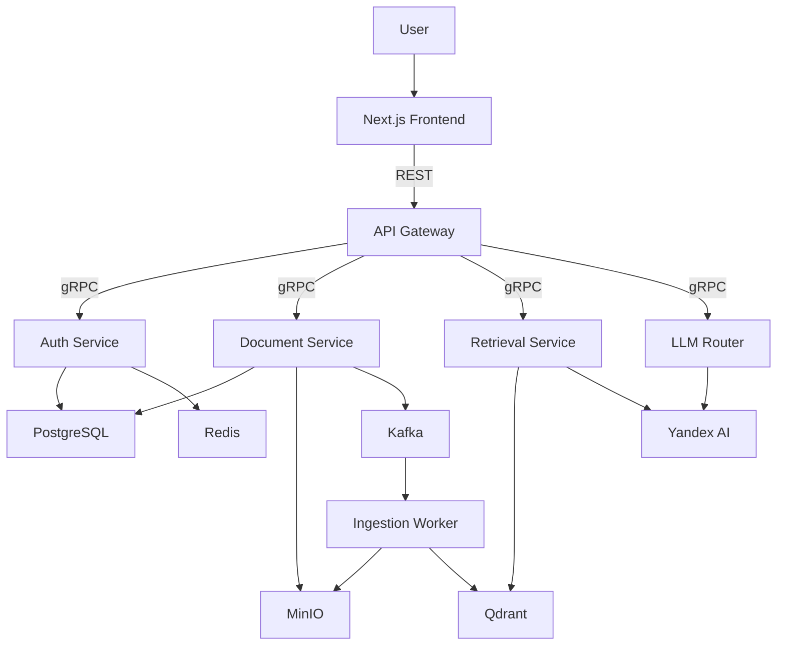

# RAG-as-a-Service

Multi-tenant Retrieval-Augmented Generation platform built with Go, Python, Next.js, Qdrant, PostgreSQL, MinIO, Redis, Kafka, and gRPC.

## Overview

RAG-as-a-Service is a team project for uploading documents, processing them asynchronously, and answering questions with context retrieved from a vector database. The platform separates public REST endpoints from internal gRPC services and carries tenant identity through the request pipeline. Documents are stored in S3-compatible storage, their metadata lives in PostgreSQL, and embeddings are indexed in Qdrant. Yandex AI provides embedding and LLM capabilities.

## Architecture



## Key engineering challenges

- **Tenant isolation:** `organization_id` is propagated between services and applied as a mandatory Qdrant filter during retrieval.
- **Asynchronous ingestion:** uploaded documents are published to Kafka, processed by a worker, split into chunks, embedded, and indexed without blocking the client request.
- **Semantic retrieval:** user queries are embedded and matched against document chunks in Qdrant with configurable limits and score thresholds.
- **Authentication between services:** the gateway validates the user flow and forwards trusted identity through internal gRPC metadata.
- **Provider abstraction:** embedding and generation logic is separated from transport and storage concerns so AI providers can be changed without rewriting the request pipeline.

## My contribution

This repository is a fork of a team project. My contribution is traceable in the Git history under `netabakovv` and includes:

- bootstrapping the local infrastructure, PostgreSQL migrations, and early Docker Compose configuration;
- connecting the frontend authentication flow to the backend, including login, registration, verification, session handling, and route protection;
- implementing the Retrieval Service end to end: protobuf contract, gRPC server, Yandex AI query embeddings, tenant-scoped Qdrant search, configuration, and tests;
- fixing the duplicate Qdrant service in Docker Compose;
- documenting Retrieval Service configuration, local startup, gRPC usage, and the expected Qdrant payload.

## Run locally

The complete flow requires Docker, Node.js, and Yandex Cloud credentials for embeddings and answer generation.

1. Configure the service `.env` files. Retrieval settings are documented in [`backend/services/retrieval/.env.example`](backend/services/retrieval/.env.example).
2. Start the backend services and infrastructure:

   ```bash
   docker compose -f backend/docker-compose.yml up --build
   ```

3. Point the frontend to the gateway in `frontend/.env.local`:

   ```env
   NEXT_PUBLIC_API_URL=http://localhost:8080
   ```

4. Start the frontend:

   ```bash
   cd frontend
   npm install
   npm run dev
   ```

The application is available at `http://localhost:3001`.

## Demo

> Video walkthrough placeholder — an end-to-end demo will be added here.

## Documentation

The original technical requirements and detailed Retrieval Service notes are preserved in [`docs/SPECIFICATION.md`](docs/SPECIFICATION.md).
