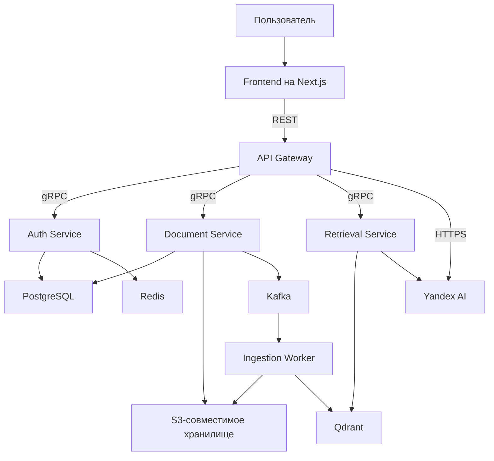

# RAG-as-a-Service

Мультитенантная платформа Retrieval-Augmented Generation, построенная на Go, Python, Next.js, Qdrant, PostgreSQL, S3-совместимом хранилище, Redis, Kafka и gRPC.

## О проекте

RAG-as-a-Service — командный проект для загрузки документов, их асинхронной обработки и генерации ответов с использованием контекста из векторной базы данных. Публичный REST API отделён от внутренних gRPC-сервисов, а tenant-данные изолируются на всём пути обработки запроса. Документы хранятся в S3-совместимом хранилище, метаданные — в PostgreSQL, а embeddings — в Qdrant. Для генерации embeddings и ответов используется Yandex AI.

## Архитектура



## Поток обработки документа

1. Клиент через API Gateway и Document Service получает presigned URL и загружает файл в S3-совместимое хранилище.
2. После подтверждения загрузки Document Service сохраняет статус документа и публикует событие в Kafka.
3. Ingestion Worker скачивает файл, извлекает текст из PDF, TXT или DOCX, разбивает его на chunks и получает embeddings через Yandex AI.
4. Chunks сохраняются в Qdrant вместе с `organization_id`, `document_id` и другими метаданными, а документ получает статус `indexed`.
5. При RAG-запросе Retrieval Service выполняет tenant-aware поиск, после чего API Gateway передаёт найденный контекст в Yandex AI и возвращает ответ вместе с источниками.

## Ключевые инженерные задачи

- **Изоляция tenant-данных:** `organization_id` передаётся между сервисами и используется как обязательный фильтр при поиске в Qdrant.
- **Асинхронный ingestion:** после загрузки документа событие публикуется в Kafka, а worker разбивает документ на chunks, генерирует embeddings и индексирует их без блокировки клиентского запроса.
- **Семантический поиск:** пользовательский запрос преобразуется в embedding и сопоставляется с фрагментами документов в Qdrant с настраиваемыми ограничениями и порогом релевантности.
- **Межсервисная аутентификация:** API Gateway проверяет пользователя и передаёт доверенные данные об организации через внутренние gRPC metadata.
- **Абстракция AI-провайдера:** логика генерации embeddings и ответов отделена от транспорта и хранилищ, поэтому провайдера можно заменить без переработки всего pipeline.

## Мой вклад

Этот репозиторий является fork командного проекта. Мой вклад можно проследить в Git-истории по автору `netabakovv`:

- подготовил начальную инфраструктуру, PostgreSQL migrations и базовую конфигурацию Docker Compose;
- связал frontend-аутентификацию с backend, включая вход, регистрацию, подтверждение аккаунта, управление сессией и защиту маршрутов;
- реализовал Retrieval Service: protobuf-контракт, gRPC-сервер, генерацию query embeddings через Yandex AI, tenant-aware поиск в Qdrant, конфигурацию и тесты;
- исправил дублирование Qdrant в Docker Compose;
- документировал конфигурацию и локальный запуск Retrieval Service, работу с gRPC и ожидаемый payload в Qdrant.

## Локальный запуск

Для полноценной работы потребуются Docker, Node.js и данные доступа к Yandex Cloud для генерации embeddings и ответов.

1. Настройте `.env`-файлы сервисов. Пример настроек Retrieval Service находится в [`backend/services/retrieval/.env.example`](backend/services/retrieval/.env.example).
2. Запустите backend-сервисы и инфраструктуру:

   ```bash
   docker compose -f backend/docker-compose.yml up --build
   ```

3. Укажите адрес API Gateway в `frontend/.env.local`:

   ```env
   NEXT_PUBLIC_API_URL=http://localhost:8080
   ```

4. Запустите frontend:

   ```bash
   cd frontend
   npm install
   npm run dev
   ```

Приложение будет доступно по адресу `http://localhost:3001`.

## Демо

> Здесь будет добавлена видеодемонстрация полного сценария работы системы.

## Документация

Исходное техническое задание и подробная документация Retrieval Service сохранены в [`docs/SPECIFICATION.md`](docs/SPECIFICATION.md).
